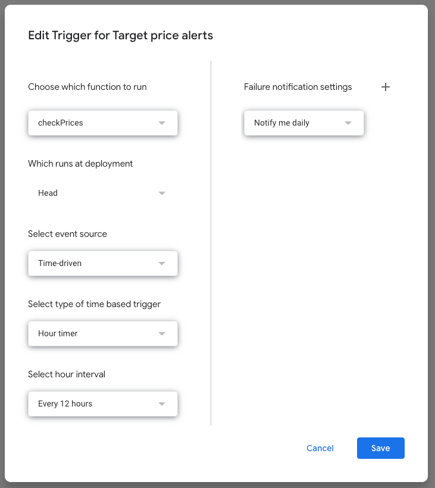

# Target price alert

## Installation

1. Import the target-price-alerts.xlsx into Google Sheets
2. Copy/paste the apps_script.js code into Extensions > Apps Script
3. In Extensions > Apps Script > Triggers, add a new trigger on the list using the following format. It's important to set the function checkPrices to run.

4. Make a few test changing the columns C and D 

### Google Sheet configuration

Blue fields needs to be filled by the user, white ones are manager automatically.
Checkbox can be disabled/enabled also manually

## Testing

Testing can be done locally.

1. uncomment last 3 lines to export the module
2. run `yarn test`
s